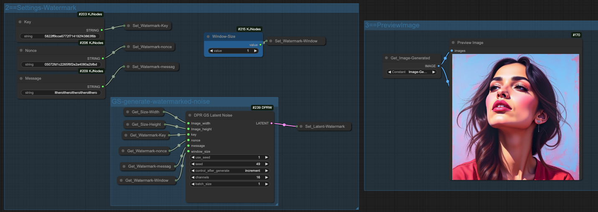

# Comfyui-GaussianShadingWatermark

[中文](README_ZH.md)  

This repository **UNOFFICIAL** a invisable watermarking method named Gaussian Shading for Comfyui.

["Gaussian Shading: Provable Performance-Lossless Image Watermarking for Diffusion Models"](https://github.com/bsmhmmlf/Gaussian-Shading) (Accepted by CVPR 2024).

This watermark tool provides a plug-and-play solution for embedding custom watermark messages into the image generation workflow. It is designed to integrate seamlessly with ComfyUI. Example workflows (for stable 1.5, PixArt, and Flux versions) are provided which cover the entire 
process of watermark embedding, image generation, and watermark extraction.



## Features
- **Easy Integration:** Simply plug this module into your ComfyUI workflows.
- **Plug-and-Play:** By default, all you need to modify is the watermark `message` parameter.
- **Complete Workflow:** Example workflows demonstrate the embedding of the watermark, generation of images, and extraction of the watermark.
- **Multiple Implementations:** The tool currently supports method Gaussian Shading (GS) for watermark embedding.

## Installation
```
cd ComfyUI/custom_nodes/
git clone https://github.com/lthero-big/Comfyui-GaussianShadingWatermark.git
```

## Usage
1. **Set the Watermark Message:**  
   Edit the `message` parameter in the node settings to your custom watermark text.
2. **Embed the Watermark:**  
   Use the provided nodes to embed the watermark into the latent noise.
3. **Generate Images:**  
   Run the workflow to generate images with the embedded watermark.
4. **Extract the Watermark:**  
   Use the extraction node to verify or recover the watermark from the output images.

## Example Workflows
Three example workflows are included:
- **MajicmixRealistic Version:** Tailored for Stable Diffusion 1.5.
- **PixArt Version:** Designed for PixArt.
- **Flux Version:** Configured for Flux.

Simply load the appropriate workflow into ComfyUI to try out the end-to-end watermark process.


